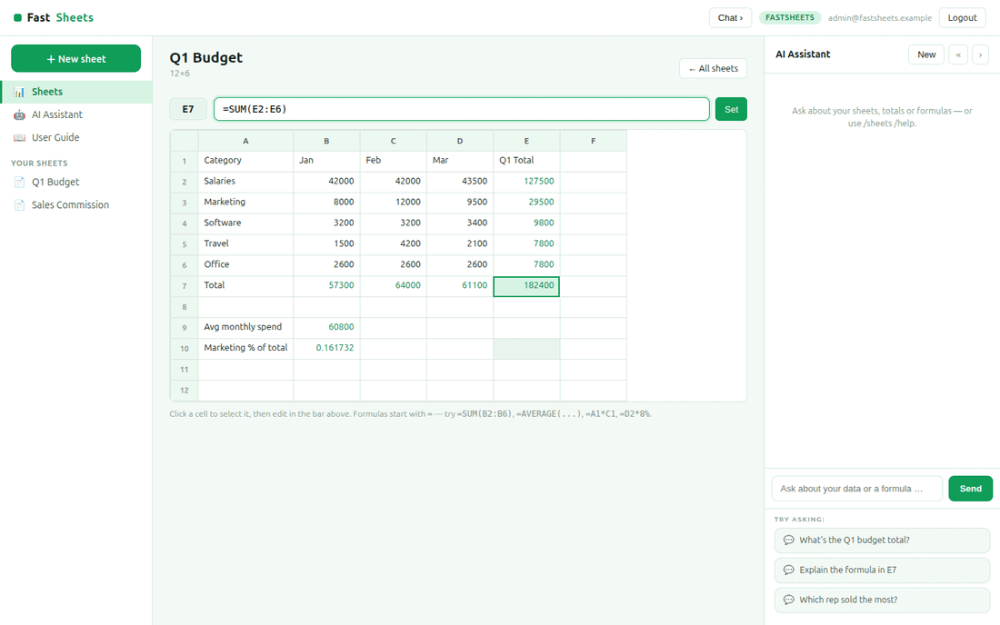

# FastSheets

**FastSheets** is an open-source **spreadsheet** built with
[FastHTML](https://fastht.ml) — a server-side, HTMX-driven port of the core of
[Frappe Sheets](https://github.com/frappe/sheets). Python-first, no JavaScript
framework: an **editable grid with a real formula engine**
(`SUM`/`AVERAGE`/`MIN`/`MAX`/`COUNT`/`PRODUCT`, cell refs, arithmetic,
percentages), multiple sheets, and an AI assistant that sees the computed values.

*Spreadsheets in pure Python.* Runs on port **5014**.

> **Synthetic data only.** Sample sheets are generated by `seed.py`.

## Demo



## Quickstart (native)

```bash
python -m venv .venv
.venv/bin/python -m pip install -r requirements.txt
cp .env.sample .env          # add an LLM key for free-form AI chat
.venv/bin/python web_app.py  # http://localhost:5014  (self-seeds on first boot)
```

Login: `admin@fastsheets.example` / `FastSheets2026$`. Reseed with
`.venv/bin/python seed.py`.

## Run with Docker

```bash
docker compose up --build      # http://localhost:5014
```

`Dockerfile` (python:3.12-slim, port 5014) seeds on first boot;
`docker-compose.yml` mounts a `fastsheets-data` volume at `/data`.

## Module tour

- **Sheets** (`/`) — your spreadsheets; click one to open it.
- **Grid** (`/sheet/{id}`) — a real spreadsheet: column headers (A, B, …), row
  numbers, a **formula bar**, formula cells highlighted, numbers right-aligned.
  Click a cell to select it, edit in the bar, press **Set** — formulas recompute.
- **New sheet** (`/new`) — create a blank grid.
- **AI Assistant** (right rail) — sees **every cell's computed value and
  formula**, so it explains results, finds totals, and suggests formulas.

## Formula engine (`engine.py`)

A small, **safe** evaluator (no `eval`): functions over ranges
(`=SUM(B2:B6)`, `=AVERAGE(A1:A3)`, `=MIN/MAX/COUNT/PRODUCT(...)`), cell refs
(`=A1*C1+5`), percentages (`=D2*8%`), and arithmetic via a restricted AST walker.
Circular references are detected and shown as `#CIRC`; bad formulas show `#ERR`.

```ini
MODEL_PROVIDER=xai          # xai | openai | anthropic | google
MODEL_NAME=grok-4-1-fast-reasoning
XAI_API_KEY=...
```

The grid and formulas work with **no API key**; only free-form AI chat needs one.

## Architecture

```
web_app.py        routes, auth, cell edit, new sheet, SSE chat
engine.py         safe formula engine (refs, ranges, functions, AST arithmetic)
db.py             SQLite sheets + cells
seed.py           deterministic sample sheets (budget, sales commission)
web/layout.py     3-pane shell, spreadsheet-grid CSS, chat JS
web/views.py      sheet list, grid + formula bar, new sheet
web/ai.py         grounded chat (renders computed cells for the model)
```

See **[SKILLS.md](SKILLS.md)** and **[docs/ROADMAP.md](docs/ROADMAP.md)**. Part of
the [`fasthtml-oss-migrations`](https://github.com/predictivelabsai/fasthtml-oss-migrations)
initiative.

## Licence

MIT.
