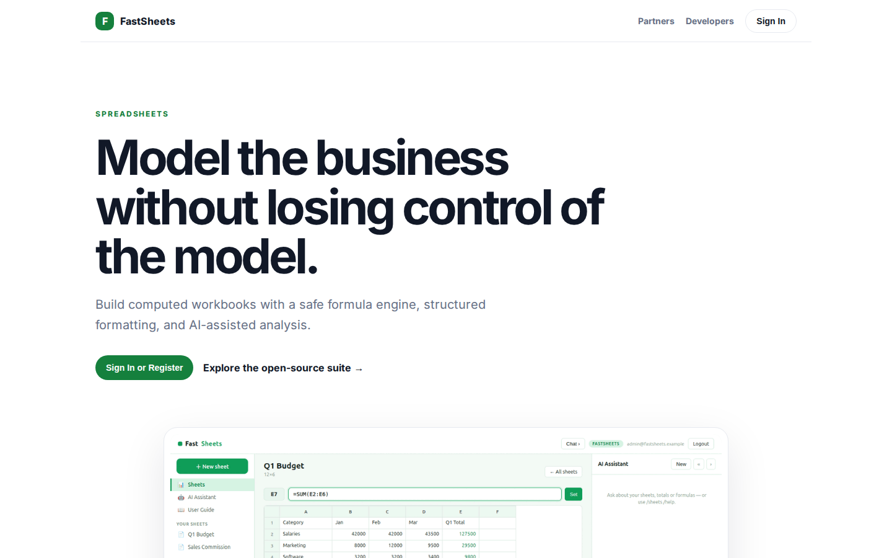
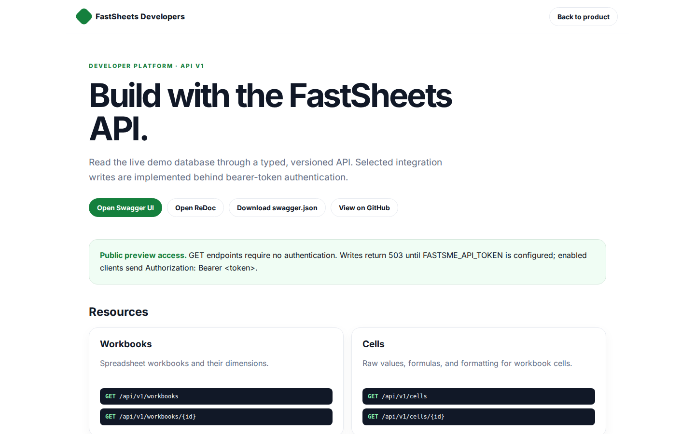

# FastSheets Platform Guide

**Published:** 2026-08-19
**Platform:** [https://sheets.fastsme.com](https://sheets.fastsme.com)
**Source:** [github.com/predictivelabsai/FastSheets](https://github.com/predictivelabsai/FastSheets)

## Platform overview

**FastSheets** is an open-source **spreadsheet** built with — a server-side, HTMX-driven port of the core of . Python-first, no JavaScript framework: an **editable grid with a real formula engine** (`SUM`/`AVERAGE`/`MIN`/`MAX`/`COUNT`/`PRODUCT`, cell refs, arithmetic, percentages), multiple sheets, and an AI assistant

This visual guide was reviewed against the live product using Playwright. Screens and available navigation can vary by account, role, and deployment configuration.

## 1. Model the business without losing control of the model.

SPREADSHEETS Model the business without losing control of the model. Build computed workbooks with a safe formula engine, structured formatting, and AI-assisted analysis. Sign In or Register Explore the open-source suite → Product tour · see the workspace in a

Screen reviewed at: [https://sheets.fastsme.com/](https://sheets.fastsme.com/)

## 2. Build with the FastSheets API.

FastSheets Developers Back to product DEVELOPER PLATFORM · API V1 Build with the FastSheets API. Read the live demo database through a typed, versioned API. Selected integration writes are implemented behind bearer-token authentication. Open Swagger UI Open Re

Screen reviewed at: [https://sheets.fastsme.com/developers](https://sheets.fastsme.com/developers)

## 3. Sign in

Sign in with Google Sign in to continue to fastsme.com Email or phone Forgot email? Next Create account Afrikaans azərbaycan bosanski català Čeština Cymraeg Dansk Deutsch eesti English (United Kingdom) English (United States) Español (España) Español (Latinoam

Screen reviewed at: [https://accounts.google.com/v3/signin/identifier?opparams=%253F&dsh=S-1088195801%3A1787122849874786&access_type=online&client_id=887059023987-2a7spj1m82eivobdbt1itb3cqca6tpt1.apps.googleusercontent.com&o2v=2&prompt=select_account&redirect_uri=https%3A%2F%2Fsheets.fastsme.com%2Fauth%2Fgoogle%2Fcallback&response_type=code&scope=openid+email+profile&service=lso&state=qGqgODMXvWZjPQ7tPtbAUt6AhJ7LrbFjl3EBcSHCtYA&flowName=GeneralOAuthLite&continue=https%3A%2F%2Faccounts.google.com%2Fsignin%2Foauth%2Flegacy%2Fconsent%3Fauthuser%3Dunknown%26part%3DAJi8hAPmdr0S3P5NkJ8TKblwhlg236jTVWZQTX7EaxC-9vgmI-OoaP_48fBNdbOB-57prki3VkfSWalebM0X-CbK654SWurlPs5gfCW8SCO_sWs_Tv_RNK24_Sl83fOoaaxER1Yi3qBk31QZk3UwTQV1-9k_67R-xzU8CilyNJkwAvxcOjqik1wu6wgC0MTPqs182J7k0UsXA13E-PgjWWIxAMaufwVjO-AbJme4IonEKZB_rDYCXTPcMDvQDVLyJrzQouYs4nOQni0Z7DjlYIGcmwMExeb44_yfs2P_3yEHI6GgCpOcIbIjCSqY7YmflKo167V4ABs4glvBhyRm7moioi1DCBnFUk0CVbHLC6yBrfZQItFgmXUnpBsvGugL8rlQYDmqS1Zos9H236SDIKgAddXtykR6yaRu3aEPDInJTxciEThYv1hvm6yYSMjY0-SFg0F_giv9rlNMUD11EZBpHldTKwdQZaJWL02ahQlAmQcGKb59J4Q%26flowName%3DGeneralOAuthFlow%26as%3DS-1088195801%253A1787122849874786%26client_id%3D887059023987-2a7spj1m82eivobdbt1itb3cqca6tpt1.apps.googleusercontent.com%23&app_domain=https%3A%2F%2Fsheets.fastsme.com&rart=ANgoxcf34_f9AUnFuRtPR8Fz6phrQbF9-QTau3JkWt6KiOZ08ZcrpA3APh96LFTbdHGIczosgVBioVpgZZUXAenABonRbHIOa3-Rp6mzQyGwIOyLg-xR0GQ](https://accounts.google.com/v3/signin/identifier?opparams=%253F&dsh=S-1088195801%3A1787122849874786&access_type=online&client_id=887059023987-2a7spj1m82eivobdbt1itb3cqca6tpt1.apps.googleusercontent.com&o2v=2&prompt=select_account&redirect_uri=https%3A%2F%2Fsheets.fastsme.com%2Fauth%2Fgoogle%2Fcallback&response_type=code&scope=openid+email+profile&service=lso&state=qGqgODMXvWZjPQ7tPtbAUt6AhJ7LrbFjl3EBcSHCtYA&flowName=GeneralOAuthLite&continue=https%3A%2F%2Faccounts.google.com%2Fsignin%2Foauth%2Flegacy%2Fconsent%3Fauthuser%3Dunknown%26part%3DAJi8hAPmdr0S3P5NkJ8TKblwhlg236jTVWZQTX7EaxC-9vgmI-OoaP_48fBNdbOB-57prki3VkfSWalebM0X-CbK654SWurlPs5gfCW8SCO_sWs_Tv_RNK24_Sl83fOoaaxER1Yi3qBk31QZk3UwTQV1-9k_67R-xzU8CilyNJkwAvxcOjqik1wu6wgC0MTPqs182J7k0UsXA13E-PgjWWIxAMaufwVjO-AbJme4IonEKZB_rDYCXTPcMDvQDVLyJrzQouYs4nOQni0Z7DjlYIGcmwMExeb44_yfs2P_3yEHI6GgCpOcIbIjCSqY7YmflKo167V4ABs4glvBhyRm7moioi1DCBnFUk0CVbHLC6yBrfZQItFgmXUnpBsvGugL8rlQYDmqS1Zos9H236SDIKgAddXtykR6yaRu3aEPDInJTxciEThYv1hvm6yYSMjY0-SFg0F_giv9rlNMUD11EZBpHldTKwdQZaJWL02ahQlAmQcGKb59J4Q%26flowName%3DGeneralOAuthFlow%26as%3DS-1088195801%253A1787122849874786%26client_id%3D887059023987-2a7spj1m82eivobdbt1itb3cqca6tpt1.apps.googleusercontent.com%23&app_domain=https%3A%2F%2Fsheets.fastsme.com&rart=ANgoxcf34_f9AUnFuRtPR8Fz6phrQbF9-QTau3JkWt6KiOZ08ZcrpA3APh96LFTbdHGIczosgVBioVpgZZUXAenABonRbHIOa3-Rp6mzQyGwIOyLg-xR0GQ)

## Getting started

Visit [https://sheets.fastsme.com](https://sheets.fastsme.com) to explore FastSheets. For source code and deployment details, use the GitHub link above.
